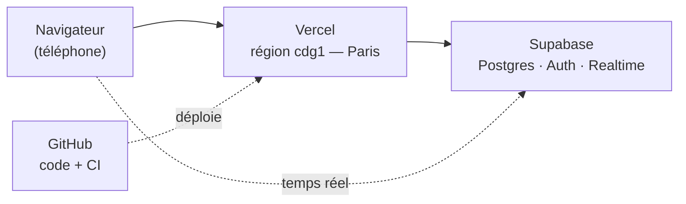
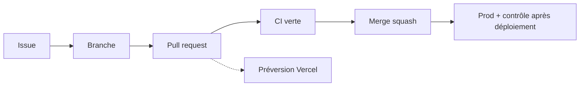

# Comment Optiperf est fait

Vue d'ensemble, volontairement simple. Les détails et les pièges vivent dans
[CLAUDE.md](../CLAUDE.md) ; les conventions de travail dans
[CONTRIBUTING.md](../CONTRIBUTING.md).

## En une phrase

Une app web mobile-first où un coach planifie des séances et où ses athlètes
notent ce qu'ils ont réellement fait — une seule application, dont l'interface
change selon le rôle du compte connecté.

## Les quatre briques



| Brique | Rôle |
|---|---|
| **Next.js** (sur Vercel) | Fabrique les pages, exécute les mutations, protège les routes. |
| **Supabase** | La base de données, les comptes, le temps réel — et **la sécurité**. |
| **Vercel** | Héberge et déploie. Configuré pour tourner à Paris, à côté de la base. |
| **GitHub** | Le code, et la CI qui vérifie chaque modification avant qu'elle parte. |

Il n'y a **pas de serveur d'API séparé** : Next.js parle directement à Supabase.

## Le trajet d'une page

1. **Le proxy** ([src/proxy.ts](../src/proxy.ts)) intercepte la requête, vérifie
   la session et pose les en-têtes de sécurité. Pas de session sur une page
   protégée → redirection vers `/login`.
2. **La page** (un composant serveur) demande ses données à Supabase et renvoie
   du HTML déjà rempli.
3. **Une action** (bouton « Enregistrer ») rappelle le serveur, qui écrit dans
   Supabase et rafraîchit la page.

## La sécurité vit dans la base, pas dans le code

C'est le choix structurant du projet. Postgres refuse lui-même les lectures et
les écritures interdites, via la **RLS** (Row Level Security) : un athlète ne
voit que ses données, un coach uniquement celles de ses athlètes liés.

Conséquence : un bug dans une page ne peut pas faire fuiter les données d'un
autre utilisateur. Et toute évolution du schéma passe par un fichier SQL
numéroté dans [supabase/migrations/](../supabase/migrations/) — jamais par une
modification à la main dans le dashboard.

## Où vit quoi

```
supabase/migrations/   Le schéma et la sécurité (SQL numéroté, appliqué à la main)
src/proxy.ts           Le gardien : session + en-têtes de sécurité
src/app/(auth)/        Connexion, inscription
src/app/(app)/         Toutes les pages qui demandent d'être connecté
src/app/auth/          Retour des liens d'email (confirmation, mot de passe)
src/lib/               Le cerveau : métriques, dates, planning, clients Supabase
src/components/        L'interface
scripts/               Données de démo (seed) et test de fumée production
e2e/ e2e-auth/ e2e-prod/   Les trois familles de tests de bout en bout
.github/workflows/     La CI et le contrôle après déploiement
```

Règle utile : **tout ce qui calcule vit dans `src/lib/`** (et y est testé), tout
ce qui affiche vit dans `src/components/`.

## Le workflow, de l'idée au déploiement



1. **Une issue** décrit le besoin ou le défaut.
2. **Une branche** par sujet — jamais de commit direct sur `master`, la
   protection GitHub le refuse.
3. **Une pull request** ouvre la discussion. Vercel en déploie une préversion
   à part, avec sa propre URL.
4. **La CI doit être verte** pour pouvoir fusionner.
5. **Merge squash** : la PR devient **un seul commit** sur `master`. Son message
   est le titre + la description de la PR — c'est pour ça qu'on les soigne, et
   pourquoi ce sont les seuls textes du projet écrits en **anglais**, au format
   Conventional Commits (voir [CONTRIBUTING.md](../CONTRIBUTING.md)).
6. **Vercel déploie la production**, puis un second workflow va vérifier le site
   réellement en ligne.

## Les tests : six étages, six métiers différents

Chaque étage voit ce que le précédent ne peut pas voir. C'est pour ça qu'ils
existent tous.

| Étage | Commande | Ce que c'est | Ce qu'il attrape | Son angle mort |
|---|---|---|---|---|
| **Unitaires** | `npm test` | Vérifie les fonctions de calcul isolément (charge, dates, semaines, RPE). Instantané. | Une formule fausse, un décalage de fuseau. | Ne sait rien de l'app réelle. |
| **Fumée** | `npm run test:e2e` | Un vrai navigateur, **sans base**. Redirections, en-têtes, pages publiques, installation sur l'écran d'accueil. | Une route qui ne protège plus, une CSP cassée. | Ne voit aucune page connectée. |
| **Connectés** | `npm run test:e2e:auth` | Un vrai navigateur **avec de vrais comptes**, contre une vraie base. Les seuls qui vérifient qu'une page connectée **affiche son contenu**. | Une page vide, une donnée manquante, un athlète qui verrait les données d'un autre. | Trop rapide en local pour reproduire certains défauts d'affichage. |
| **Largeur bureau** | `npm run test:e2e:bureau` | Les mêmes comptes et la même base que les connectés, mais en 1440 × 900. | Une mise en page qui casse à la souris : navigation, grilles, débordement horizontal. | Ne teste que la largeur, pas la logique. |
| **Fumée production** | `npm run smoke` | Interroge le **site en ligne** sans navigateur : routage du CDN, en-têtes, réponses attendues. | Un problème apparu seulement une fois déployé. | Regarde les réponses, pas l'écran. |
| **Affichage production** | `npm run test:prod` | Un vrai navigateur contre le **site en ligne**, connecté au compte de démo. | Le cas où une page **répond correctement mais n'affiche rien** — le mode de panne de l'incident #44. | Ne tourne qu'après déploiement. |

**Quand ça tourne tout seul :** les quatre premiers étages à chaque pull request
(GitHub Actions) ; les deux derniers automatiquement après chaque déploiement
de production.

**Pourquoi six et pas trois** : un incident a traversé une CI entièrement verte
parce qu'aucun test n'ouvrait une page **avec une session**, et parce qu'aucun
ne regardait le site **réellement déployé**. Les étages « connectés » et
« affichage production » sont nés de là. Le sixième, « largeur bureau », est né
d'un constat plus simple : toute la suite tournait en viewport de téléphone,
donc rien n'aurait signalé une régression sur l'écran où le coach planifie.

## Les deux automatismes de la CI

- **À chaque pull request** ([ci.yml](../.github/workflows/ci.yml)) : lint,
  types, tests unitaires, build, tests de fumée — puis un second travail qui
  démarre une base Supabase neuve, y applique **les migrations du dépôt** et
  joue les parcours connectés. Ce second travail garantit que le dépôt seul
  suffit à reconstruire une base qui marche.
- **Après chaque déploiement de production**
  ([smoke-prod.yml](../.github/workflows/smoke-prod.yml)) : fumée production
  puis contrôle d'affichage dans un vrai navigateur.

## Le seul geste manuel qui reste

Les migrations SQL sont appliquées **à la main** en production, dans le SQL
Editor de Supabase, dans l'ordre numérique. La CI vérifie qu'elles sont valides,
mais rien ne vérifie automatiquement que la production les a toutes reçues :
c'est à contrôler après chaque PR qui ajoute un fichier dans
`supabase/migrations/`.
