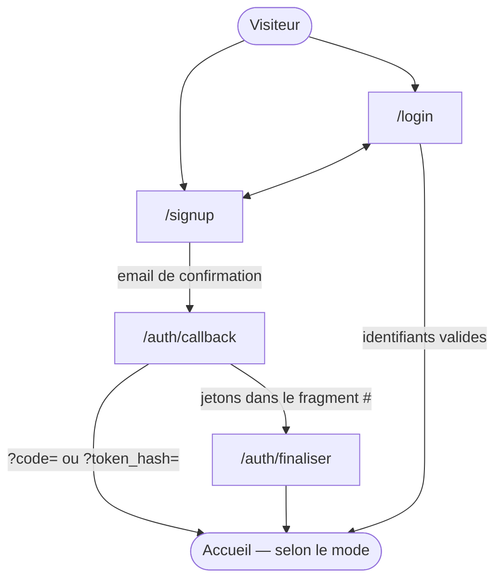
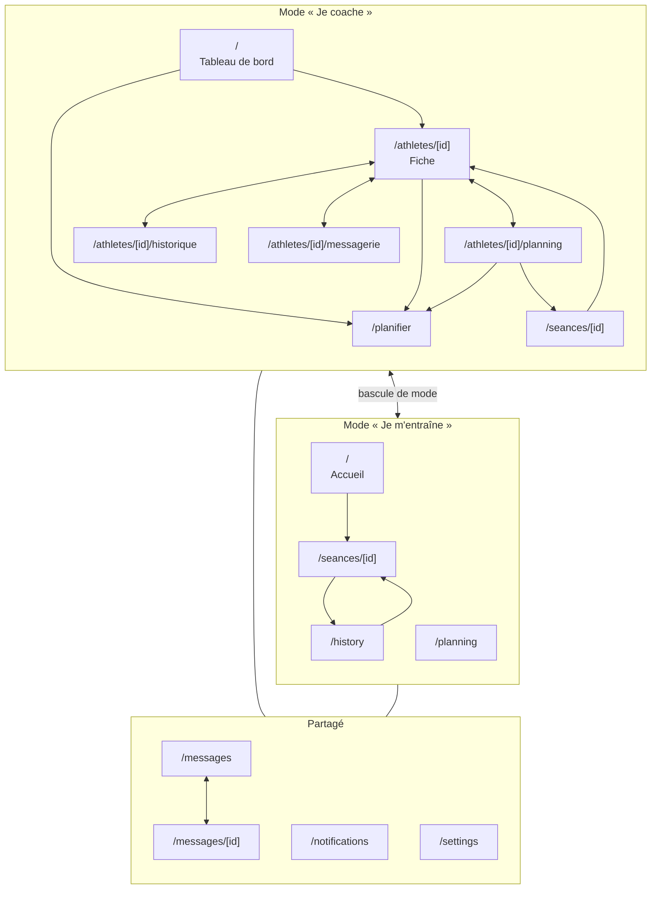

# Les pages et leurs enchaînements

Toutes les pages d'Optiperf, qui y a accès, et par quels chemins on passe de
l'une à l'autre. C'est la carte du site : à lire avant d'ajouter un écran, pour
savoir d'où on y entrera et où l'on ira ensuite.

Le catalogue des fonctionnalités est dans
[fonctionnalites.md](fonctionnalites.md), le modèle de données dans
[donnees.md](donnees.md), l'architecture technique dans
[architecture.md](architecture.md). Index : [docs/](README.md).

Cette carte est **tenue par un test** : `src/lib/docs-parcours.test.ts` échoue
si une route de `src/app/` n'y figure pas.

## Trois zones, trois régimes d'accès

| Zone | Routes | Qui entre | Posé par |
|---|---|---|---|
| **Publique** | `/login`, `/signup` | Tout le monde | `src/app/(auth)/` |
| **Retour d'email** | `/auth/callback`, `/auth/finaliser` | Tout le monde, jeton en main | `src/app/auth/` |
| **Connectée** | tout le reste | Compte avec un profil | `src/app/(app)/` |

Deux gardiens, et ils ne font pas le même travail :

- **[`src/proxy.ts`](../src/proxy.ts)** intercepte chaque requête, vérifie la
  session et pose les en-têtes de sécurité. Sans session sur une page
  connectée → `/login`. Avec session sur `/login` → `/`.
- **Le layout `(app)`** relit le profil. Un compte authentifié **sans ligne
  dans `profiles`** est déconnecté — sans quoi le layout renverrait vers
  `/login` et le proxy vers `/`, indéfiniment.

`/auth/*` reste **public** : la confirmation d'email serait interrompue avant
de s'exécuter. Le manifeste et les icônes d'installation restent **hors du
matcher du proxy** : le système d'exploitation les récupère sans cookie.

## Entrer dans l'app

Le détour par `/auth/finaliser` n'est pas une coquetterie : dans le flux
implicite, les jetons arrivent dans le **fragment** (`#access_token=…`), que le
navigateur n'envoie jamais au serveur. Seule une page cliente peut les lire.

## Une fois connecté : deux modes, pas deux comptes

Le `role` est unique en base ; c'est le **mode d'affichage** qui décide de ce
que l'app montre. Un coach bascule entre « Je coache » et « Je m'entraîne » sans
changer de compte — le mode vit dans un cookie, jamais dans un droit.

Les quatre onglets d'un athlète (`AthleteNav`) partagent un layout qui vérifie
l'accès **une fois pour les quatre**, et permet de passer d'un athlète à l'autre
en gardant l'onglet courant.

## Le catalogue des routes

| Route | Mode | Ce qu'on y fait | On y arrive depuis | On en repart vers |
|---|---|---|---|---|
| `/login` | — | Se connecter | Toute page protégée sans session | `/`, `/signup` |
| `/signup` | — | Créer un compte, choisir son rôle | `/login` | `/login`, email de confirmation |
| `/auth/callback` | — | Ouvrir la session depuis un lien d'email | Email | `/`, `/auth/finaliser` |
| `/auth/finaliser` | — | Lire les jetons du fragment | `/auth/callback` | `/` |
| `/` | Coach | Une carte par athlète : volume, adhérence, RPE moyen, charge, état de forme | Navigation | `/athletes/[id]`, `/planifier` |
| `/` | Athlète | Séances à venir, saisie du réalisé, séance libre, import de montre | Navigation | `/seances/[id]` |
| `/athletes/[id]` | Coach | Fiche : métriques 7 j, zones FC, records, **notes privées**, objectifs | Tableau de bord | Les trois autres onglets, `/planifier` |
| `/athletes/[id]/planning` | Coach | Vue semaine de l'athlète, contenu des séances, déplacement | Onglets | `/planifier`, `/seances/[id]` |
| `/athletes/[id]/historique` | Coach | Séances passées et courbes de charge | Onglets | `/seances/[id]` |
| `/athletes/[id]/messagerie` | Coach | Fil de discussion avec cet athlète | Onglets, carte athlète | — |
| `/planifier` | Coach | Prescrire : athlètes × dates en une fois, modèles, blocs, exercices | Tableau de bord, fiche, planning | `/` |
| `/planning` | Athlète | Sa propre semaine, en lecture | Navigation | — |
| `/history` | Athlète | Son historique et ses courbes | Navigation | `/seances/[id]` |
| `/seances/[id]` | Les deux | Détail d'une séance. **Formulaire de prescription pour le coach**, compte rendu pour l'athlète | Listes, planning, historique | `/history` ou `/athletes/[id]` selon le propriétaire |
| `/messages` | Les deux | Liste des fils | Navigation | `/messages/[id]` |
| `/messages/[id]` | Les deux | Fil de discussion, temps réel | `/messages` | — |
| `/notifications` | Les deux | Ce qui s'est passé, marqué lu en bloc | Navigation | Lien porté par la notification |
| `/settings` | Les deux | Nom, FC max/repos, records, VMA, coach, code d'invitation, suppression du compte | Navigation | — |

## Trois enchaînements qui ne vont pas de soi

**Le retour d'une séance dépend du propriétaire, pas du rôle.** `/seances/[id]`
revient vers `/history` si la séance appartient au compte connecté, vers
`/athletes/[id]` sinon. Le bon critère est `profile.id === session.athlete_id` —
depuis qu'un coach peut s'entraîner, le rôle ne suffit plus à trancher.

**L'athlète n'a aucun lien vers `/seances/[id]` pour une séance planifiée.**
Cette page ouvre le **formulaire de prescription** : il y saisirait une
modification que le trigger `enforce_session_ownership` refuserait à
l'enregistrement. Il déclare ses séances faites depuis l'accueil.

**Il n'existe plus de formulaire de planification par athlète.** Toute entrée
dans la planification pointe vers `/planifier`, éventuellement avec `?athlete=`
ou `?date=`. Un nouvel écran qui prescrit doit faire de même.

## Ce qui ne crée pas de page

- **La bascule de mode** est une action serveur qui réécrit un cookie et
  rafraîchit : même URL, autre contenu.
- **Le déplacement d'une séance** se fait dans la vue semaine, sans navigation.
- **L'import d'un fichier de montre** est lu par le navigateur ; seules les
  valeurs affichées partent au serveur.
- **Aucune route n'a de `loading.tsx`.** Le retour visuel de navigation passe
  par un trait posé sous l'onglet touché — voir
  [CLAUDE.md](../CLAUDE.md) pour l'incident qui a fermé cette voie.
